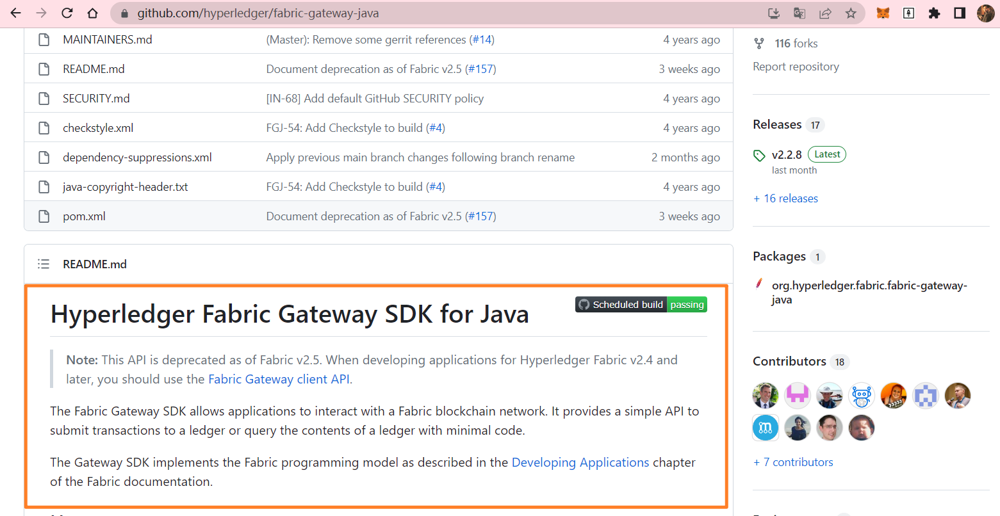
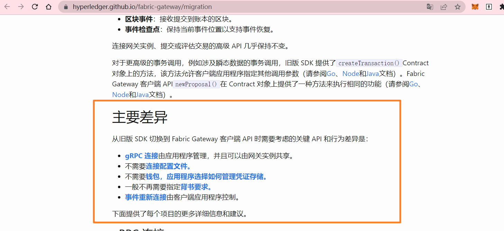

# 版本说明

2.2版本是我在做毕设时的版本，如有问题请提交issue

2.5版本代码中只有fabric-gateway

# Fabric Gateway

fabric-gateway-java项目从 Fabric v2.5 开始，此 API 已弃用。在为 Hyperledger Fabric v2.4 及更高版本开发应用程序时，您应该使用[Fabric Gateway 客户端 API](https://hyperledger.github.io/fabric-gateway/)。

# 关于两者的差异

https://hyperledger.github.io/fabric-gateway/migration

