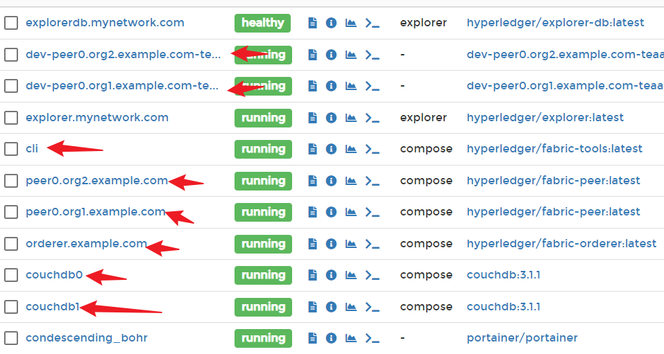
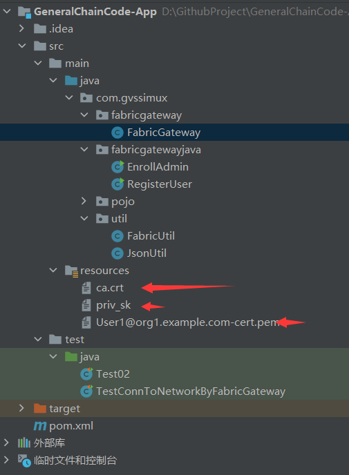
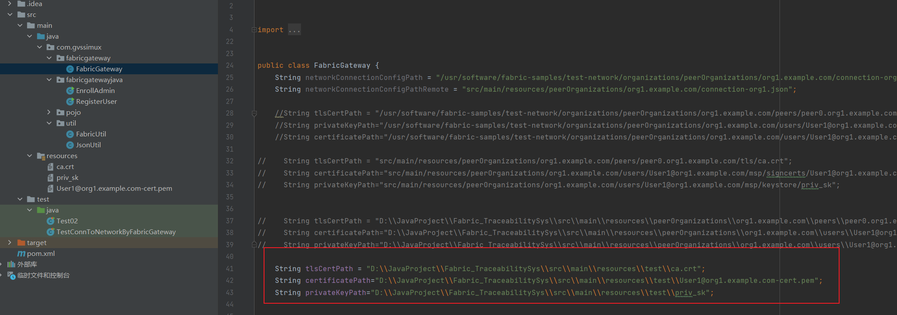
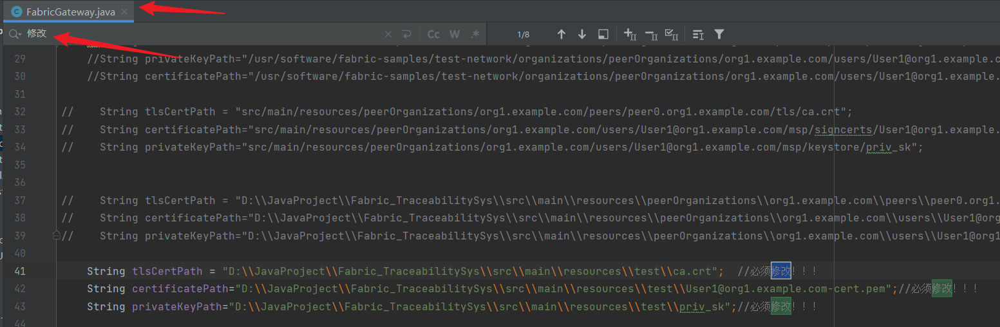
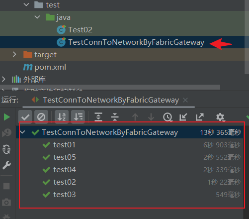
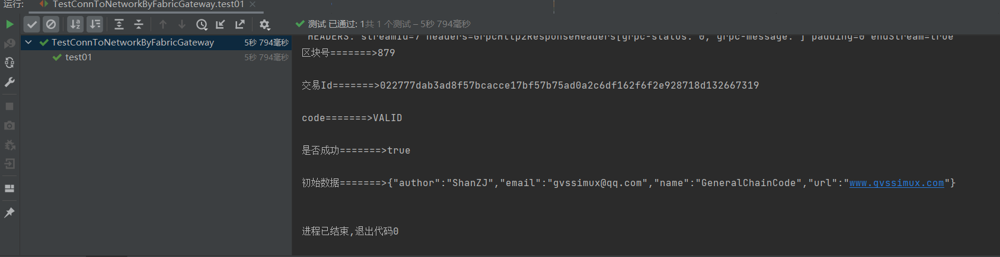
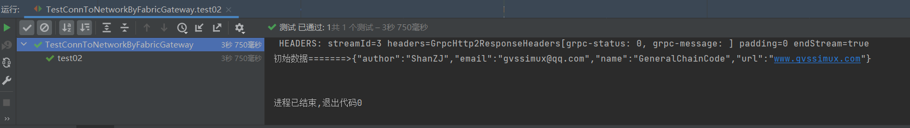
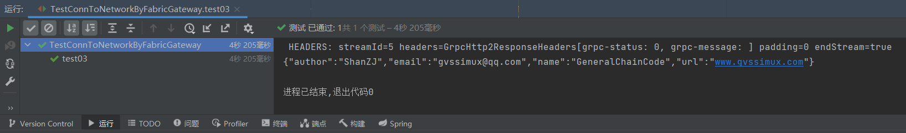
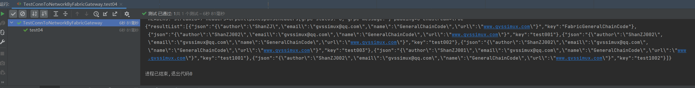
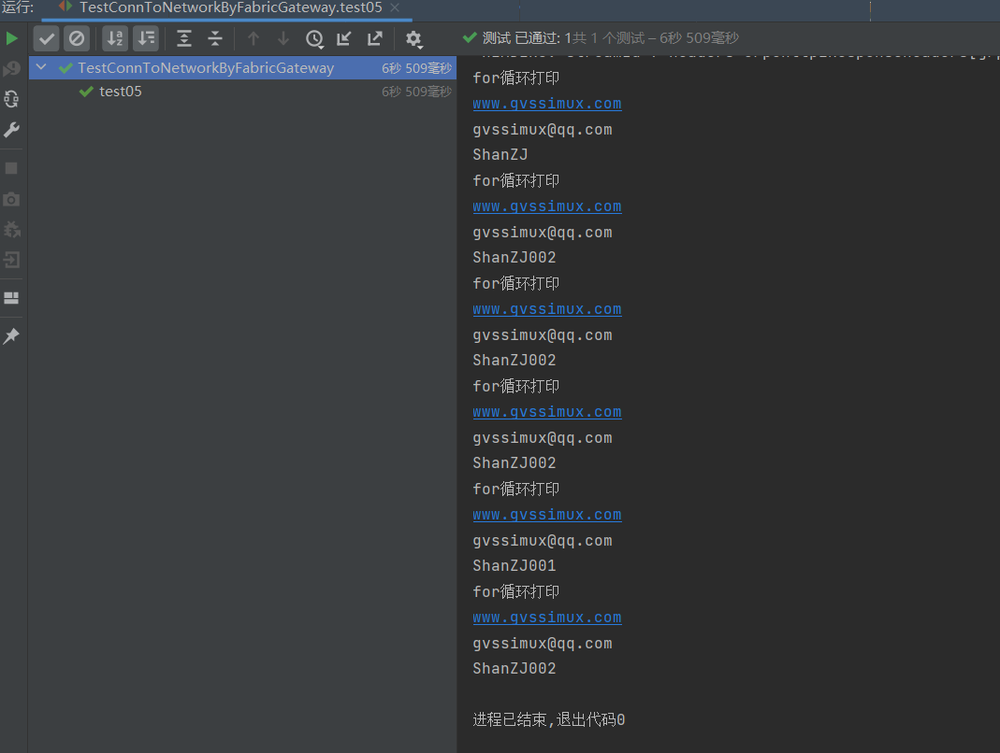

# 1. 前提

首先确保你的Fabric网络启动起来了



并且在bash里可以执行“安装链码的相关操作.md”中的富查询命令

> 因为绝大数业务都是要用的富查询的，建议还是配一下比较好~


# 2. 准备文件

当你使用`./network.sh up createChannel -s couchdb`启动好了测试网络后

你会发现在`fabric-samples/test-network/organizations/`中生成一些文件

**找到以下文件**

```bash
/usr/software/fabric-samples/test-network/organizations/peerOrganizations/org1.example.com/peers/peer0.org1.example.com/tls/ca.crt

/usr/software/fabric-samples/test-network/organizations/peerOrganizations/org1.example.com/users/User1@org1.example.com/msp/keystore/priv_sk

/usr/software/fabric-samples/test-network/organizations/peerOrganizations/org1.example.com/users/User1@org1.example.com/msp/signcerts/User1@org1.example.com-cert.pem

```

**将其复制到项目中**



或者你也可以在`FabricGateway.java`中直接指定



> 注意，一定要指定好这三个文件的地址，确保你的应用程序能够读到这三个文件


# 3. 需要修改的地方

需要修改的地方应该只在`FabricGateway.java`，如果你修改了其他地方可能会出现错误，当然如果你确保了`FabricGateway.java`中的修改准确无误，可能是你的网络出现些问题，有可能是节点挂掉了。

可直接全文搜索'修改'两字



# 4. 运行



测试详情如下











> test04和test05的结果你运行可能与我不同，可能是只有一条数据，我是后来测试又插入了几条