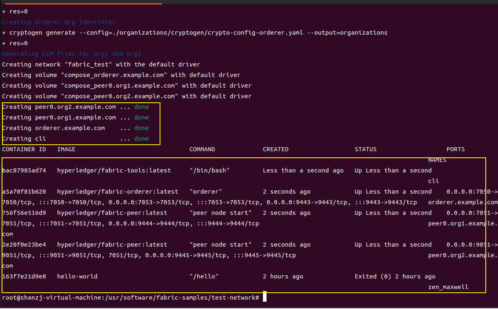
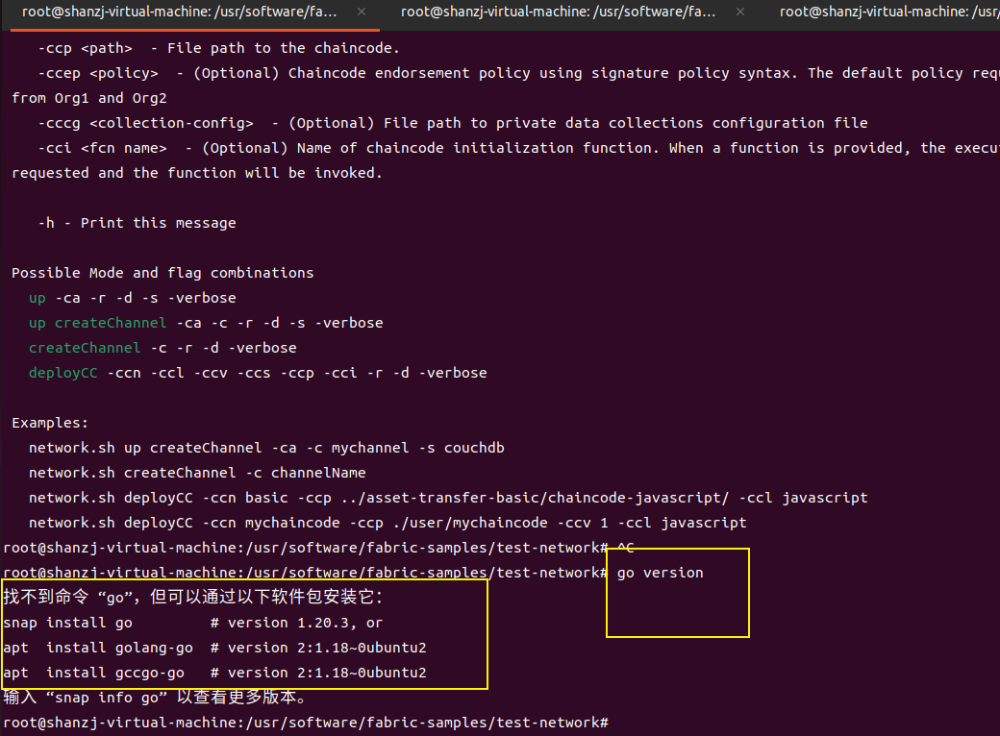
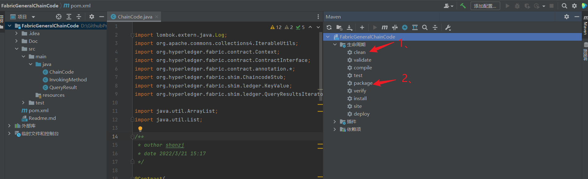
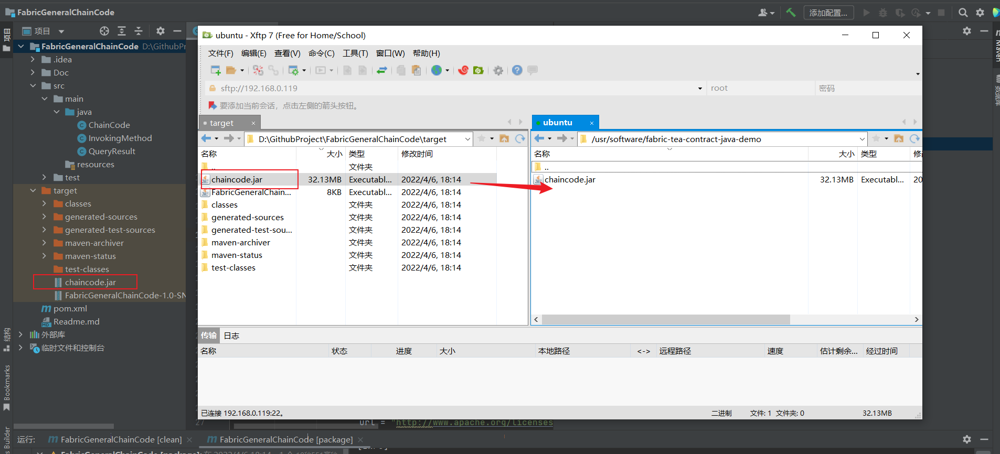

# 0. 前提准备

您需要按照`环境配置和文件下载.md`配置环境

## 0.1 如何查看环境是否符合条件

进入官方的测试目录

```bash
cd /usr/software/fabric-samples/test-network
```

```bash
./network.sh up
```

**没问题就会启动如下docker**

分别是：2个peer容器，1个fabric-tools，1个order节点



**然后关闭**

```bash
./network.sh down
```

> **如果你启动不成功，那你环境肯定是有问题的，就不要看下面的了，先检查环境**（如果你是Java技术栈，不用安装Go）
>
> 
>
> **最好的办法就是，再重新建一个虚拟机，从头来，这个最好的办法，网上关于fabric的解答很少，一般重装都能解决90%问题**

## 0.2 在本地打包链码

> 不想自己打包的话，就直接用github仓库里的



## 0.3 上传链码到虚拟机中

> 注意：这里的文件夹路径，如果您的文件夹路径与我不同，您在之后的操作可能会出现问题
>
> 您可在后面的操作中，注意修改命令中的路径  `/usr/software/fabric-tea-contract-java-demo/`




# 1. 启动测试网络

> 注意：你可能在0.准备中已经启动过了网络
>
> 进去test-network项目目录  `cd fabric-samples/test-network`
>
> 运行命令 `./network.sh down`  用以关闭你之前启动的测试网络

## 1.1 进入到test-network所在目录

返回到test-network所在目录，以便可以将链码与其他网络部件打包在一起。

```bash
cd /usr/software/fabric-samples/test-network
```

## 1.2 启动测试网络

```bash
./network.sh up createChannel -s couchdb
```


# 2. 打包智能合约

## 2.1 进入到test-network所在目录

进入到test-network所在目录，以便可以将链码与其他网络部件打包在一起。

```bash
cd /usr/software/fabric-samples/test-network
```

## 2.2 将bin目录中二进制文件添加到CLI路径

所需格式的链码包可以使用peer CLI创建，使用以下命令将这些二进制文件添加到你的CLI路径。

```bash
export PATH=${PWD}/../bin:$PATH
```

## 2.3 设置FABRIC_CFG_PATH为指向fabric-samples中的core.yaml文件

```bash
export FABRIC_CFG_PATH=$PWD/../config/
```

## 2.4 创建链码包

```bash
peer lifecycle chaincode package teaArea-java-demo.tar.gz --path /usr/software/fabric-tea-contract-java-demo/ --lang java --label teaArea-java-demo_1
```

命令解释：此命令将在当前目录中创建一个名为 teaArea-java-demo.tar.gz的软件包。–lang标签用于指定链码语言，–path标签提供智能合约代码的位置，该路径必须是标准路径或相对于当前工作目录的路径，–label标签用于指定一个链码标签，该标签将在安装链码后对其进行标识。建议您的标签包含链码名称和版本。

现在，我们已经创建了链码包，我们可以在测试网络的对等节点上安装链码。


# 3. 安装链码

打包 fabric-tea-contract-java-demo 智能合约后，我们可以在peer节点上安装链码。需要在认可交易的每个peer节点上安装链码。因为我们将设置背书策略以要求来自Org1和Org2的背书，所以我们需要在两个组织的peer节点上安装链码：peer0.org1.example.com和peer0.org2.example.com


##  3.1 Org1 peer节点安装链码

设置以下环境变量，以Org1管理员的身份操作peer CLI。

```bash
export CORE_PEER_TLS_ENABLED=true
export CORE_PEER_LOCALMSPID="Org1MSP"
export CORE_PEER_TLS_ROOTCERT_FILE=${PWD}/organizations/peerOrganizations/org1.example.com/peers/peer0.org1.example.com/tls/ca.crt
export CORE_PEER_MSPCONFIGPATH=${PWD}/organizations/peerOrganizations/org1.example.com/users/Admin@org1.example.com/msp
export CORE_PEER_ADDRESS=localhost:7051
```

使用 peer lifecycle chaincode install 命令在peer节点上安装链码。

```bash
peer lifecycle chaincode install teaArea-java-demo.tar.gz
```

##  3.2 Org2 peer节点安装链码

设置以下环境变量，以Org2管理员的身份操作peer CLI。

```bash
export CORE_PEER_TLS_ENABLED=true
export CORE_PEER_LOCALMSPID="Org2MSP"
export CORE_PEER_TLS_ROOTCERT_FILE=${PWD}/organizations/peerOrganizations/org2.example.com/peers/peer0.org2.example.com/tls/ca.crt
export CORE_PEER_TLS_ROOTCERT_FILE=${PWD}/organizations/peerOrganizations/org2.example.com/peers/peer0.org2.example.com/tls/ca.crt
export CORE_PEER_MSPCONFIGPATH=${PWD}/organizations/peerOrganizations/org2.example.com/users/Admin@org2.example.com/msp
export CORE_PEER_ADDRESS=localhost:9051
```

使用 peer lifecycle chaincode install 命令在peer节点上安装链码。

```bash
peer lifecycle chaincode install teaArea-java-demo.tar.gz
```

> 注意：安装链码时，链码由peer节点构建。如果智能合约代码有问题，install命令将从链码中返回所有构建错误。 因为安装 java 链码的时候需要经过 maven 构建以及下载依赖包的过程这个过程有可能会较慢，所以 install 命令有可能会返回一个超时错误:。但是其实链码的 docker 容器内此时还在执行构建任务没有完成。等到构建成功了链码包也就安装成功了。

#  4. 通过链码定义

安装链码包后，需要组织通过链码定义。该定义包括链码管理的重要参数，例如名称，版本和链码认可策略。

包ID用于将peer节点上安装的链码与通过的链码定义相关联，并允许组织使用链码来认可交易。

##  4.1 查询包ID

```bash
peer lifecycle chaincode queryinstalled
```

包ID是链码标签和链码二进制文件的哈希值的组合。每个peer节点将生成相同的包ID。你应该看到类似于以下内容的输出：

```bash
Installed chaincodes on peer:
Package ID: teaArea-java-demo_1:c06dd578202de3dd5d27f4526f8005b8d4d88c80f0529b6c1455b129b63bbb3e, Label: teaArea-java-demo_1
Package ID: fabcar_1:ef4ec70497b080be752fadb44def86a40de9f822bb776c250bb924e9b1d91b06, Label: fabcar_1
```

通过链码时，我们将使用包ID，因此，将包ID保存为环境变量。将返回的包ID粘贴到下面的命令中。 **注意：包ID对于所有用户而言都不相同，因此需要使用上一步中从命令窗口返回的包ID来完成此步骤。而不是直接复制命令！！！**

```bash
export CC_PACKAGE_ID=teaArea-java-demo_1:ed459d2XXXXXXXXXXXXXXXXXXX
```

## 4.2 Org2 通过链码定义

因为已经设置了环境变量为peer CLI作为Orig2管理员进行操作，所以我们可以以Org2组织级别将 hyperledger-fabric-contract-java-demo 的链码定义通过。使用 peer lifecycle chaincode approveformyorg命令通过链码定义：

```bash
peer lifecycle chaincode approveformyorg -o localhost:7050 --ordererTLSHostnameOverride orderer.example.com --channelID mychannel --name teaArea-java-demo --version 1.0 --package-id $CC_PACKAGE_ID --sequence 1 --tls --cafile ${PWD}/organizations/ordererOrganizations/example.com/orderers/orderer.example.com/msp/tlscacerts/tlsca.example.com-cert.pem
```

## 4.2 Org1 通过链码定义

设置以下环境变量以Org1管理员身份运行：

```bash
export CORE_PEER_LOCALMSPID="Org1MSP"
export CORE_PEER_MSPCONFIGPATH=${PWD}/organizations/peerOrganizations/org1.example.com/users/Admin@org1.example.com/msp
export CORE_PEER_TLS_ROOTCERT_FILE=${PWD}/organizations/peerOrganizations/org1.example.com/peers/peer0.org1.example.com/tls/ca.crt
export CORE_PEER_ADDRESS=localhost:7051
```

用 peer lifecycle chaincode approveformyorg命令通过链码定义

```bash
peer lifecycle chaincode approveformyorg -o localhost:7050 --ordererTLSHostnameOverride orderer.example.com --channelID mychannel --name teaArea-java-demo --version 1.0 --package-id $CC_PACKAGE_ID --sequence 1 --tls --cafile ${PWD}/organizations/ordererOrganizations/example.com/orderers/orderer.example.com/msp/tlscacerts/tlsca.example.com-cert.pem
```

# 5. 将链码定义提交给通道

使用peer lifecycle chaincode checkcommitreadiness命令来检查通道成员是否已批准相同的链码定义：

```bash
peer lifecycle chaincode checkcommitreadiness --channelID mychannel --name teaArea-java-demo --version 1.0 --sequence 1 --tls --cafile ${PWD}/organizations/ordererOrganizations/example.com/orderers/orderer.example.com/msp/tlscacerts/tlsca.example.com-cert.pem --output json
```

该命令将生成一个JSON映射，该映射显示通道成员是否批准了checkcommitreadiness命令中指定的参数：

```bash
{
	"approvals": {
		"Org1MSP": true,
		"Org2MSP": true
	}
}
```

**由于作为通道成员的两个组织都同意了相同的参数，因此链码定义已准备好提交给通道。你可以使用peer lifecycle chaincode commit命令将链码定义提交到通道。commit命令还需要由组织管理员提交。**

```bash
peer lifecycle chaincode commit -o localhost:7050 --ordererTLSHostnameOverride orderer.example.com --channelID mychannel --name teaArea-java-demo --version 1.0 --sequence 1 --tls --cafile ${PWD}/organizations/ordererOrganizations/example.com/orderers/orderer.example.com/msp/tlscacerts/tlsca.example.com-cert.pem --peerAddresses localhost:7051 --tlsRootCertFiles ${PWD}/organizations/peerOrganizations/org1.example.com/peers/peer0.org1.example.com/tls/ca.crt --peerAddresses localhost:9051 --tlsRootCertFiles ${PWD}/organizations/peerOrganizations/org2.example.com/peers/peer0.org2.example.com/tls/ca.crt
```

可以使用peer lifecycle chaincode querycommitted命令来确认链码定义已提交给通道。

```bash
peer lifecycle chaincode querycommitted --channelID mychannel --name teaArea-java-demo --cafile ${PWD}/organizations/ordererOrganizations/example.com/orderers/orderer.example.com/msp/tlscacerts/tlsca.example.com-cert.pem
```

如果将链码成功提交给通道，该querycommitted命令将返回链码定义的顺序和版本:

```bash
Version: 1.0, Sequence: 1, Endorsement Plugin: escc, Validation Plugin: vscc, Approvals: [Org1MSP: true, Org2MSP: true]
```

# 6. 调用链码


```bash
# 初识化链码
peer chaincode invoke -o localhost:7050 --ordererTLSHostnameOverride orderer.example.com --tls --cafile ${PWD}/organizations/ordererOrganizations/example.com/orderers/orderer.example.com/msp/tlscacerts/tlsca.example.com-cert.pem -C mychannel -n teaArea-java-demo --peerAddresses localhost:7051 --tlsRootCertFiles ${PWD}/organizations/peerOrganizations/org1.example.com/peers/peer0.org1.example.com/tls/ca.crt --peerAddresses localhost:9051 --tlsRootCertFiles ${PWD}/organizations/peerOrganizations/org2.example.com/peers/peer0.org2.example.com/tls/ca.crt -c '{"function":"initLedger","Args":[]}'

# 查询初识化的数据
peer chaincode query -C mychannel -n teaArea-java-demo -c '{"Args":["queryData" , "FabricGeneralChainCode"]}'


# 增加数据
peer chaincode invoke -o localhost:7050 --ordererTLSHostnameOverride orderer.example.com --tls --cafile ${PWD}/organizations/ordererOrganizations/example.com/orderers/orderer.example.com/msp/tlscacerts/tlsca.example.com-cert.pem -C mychannel -n teaArea-java-demo --peerAddresses localhost:7051 --tlsRootCertFiles ${PWD}/organizations/peerOrganizations/org1.example.com/peers/peer0.org1.example.com/tls/ca.crt --peerAddresses localhost:9051 --tlsRootCertFiles ${PWD}/organizations/peerOrganizations/org2.example.com/peers/peer0.org2.example.com/tls/ca.crt -c '{"function":"createData","Args":["email2","gvssimux@qq.com"]}'

# 查询数据
peer chaincode query -C mychannel -n teaArea-java-demo -c '{"Args":["queryData" , "email2"]}'


# 更新数据
peer chaincode invoke -o localhost:7050 --ordererTLSHostnameOverride orderer.example.com --tls --cafile ${PWD}/organizations/ordererOrganizations/example.com/orderers/orderer.example.com/msp/tlscacerts/tlsca.example.com-cert.pem -C mychannel -n teaArea-java-demo --peerAddresses localhost:7051 --tlsRootCertFiles ${PWD}/organizations/peerOrganizations/org1.example.com/peers/peer0.org1.example.com/tls/ca.crt --peerAddresses localhost:9051 --tlsRootCertFiles ${PWD}/organizations/peerOrganizations/org2.example.com/peers/peer0.org2.example.com/tls/ca.crt -c '{"function":"updateData","Args":["email1","gvssimux@gmail.com"]}'


# 删除数据
peer chaincode invoke -o localhost:7050 --ordererTLSHostnameOverride orderer.example.com --tls --cafile ${PWD}/organizations/ordererOrganizations/example.com/orderers/orderer.example.com/msp/tlscacerts/tlsca.example.com-cert.pem -C mychannel -n teaArea-java-demo --peerAddresses localhost:7051 --tlsRootCertFiles ${PWD}/organizations/peerOrganizations/org1.example.com/peers/peer0.org1.example.com/tls/ca.crt --peerAddresses localhost:9051 --tlsRootCertFiles ${PWD}/organizations/peerOrganizations/org2.example.com/peers/peer0.org2.example.com/tls/ca.crt -c '{"function":"deleteData","Args":["email1"]}'


# 全部查询
peer chaincode query -C mychannel -n teaArea-java-demo -c '{"Args":["queryAllByKey" , "email","2","5"]}'
意思是：查询区块链中email2，email3，email4的key对应的值


# 富查询
peer chaincode query -C mychannel -n teaArea-java-demo -c '{"Args":["richQuery" , "{\"selector\":{\"author\":\"ShanZJ\"}, \"use_index\":[]}"]}'

```

