# 1. 官方脚本安装

初次使用ubuntu搭建fabric测试网络，必须环境

## 1.1 前提准备

系统：Ubuntu22.04LTS（运行在VMware上）

Ubuntu开启root远程登录

- Git client
- Go version 1.16.x (recommended Go version can be found in project Makefile)
- Docker version 18.03 or later

### 1.1.1 GIT安装

```bash
apt-get install git
```

**Git配置**

**首先要配置的名字和Email地址**，以后每次进行git操作时才能有据可查。打开Git Bash，输入：

```bash
$ git config --global user.name 'your_name'
$ git config --global user.email 'your_email'
```

**创建SSH Key**

> SSH Key必须配置到你的github账户里去

```bash
$ ssh-keygen -t rsa -C 'your_email'
然后一直回车

root@shanzj-virtual-machine:/usr/software# cd ~
root@shanzj-virtual-machine:~# ll
总用量 40
drwx------  4 root root 4096 1月  12 15:47 ./
drwxr-xr-x 20 root root 4096 1月  12 15:08 ../
-rw-------  1 root root   87 1月  12 15:36 .bash_history
-rw-r--r--  1 root root 3106 12月  5  2019 .bashrc
drwx------  2 root root 4096 1月  12 15:37 .cache/
-rw-r--r--  1 root root   28 1月  12 15:47 .gitconfig
-rw-r--r--  1 root root  161 12月  5  2019 .profile
drwx------  2 root root 4096 1月  12 15:49 .ssh/
-rw-------  1 root root 1352 1月  12 15:43 .viminfo
-rw-------  1 root root  136 1月  12 15:42 .Xauthority
root@shanzj-virtual-machine:~# cd /root/.ssh/
root@shanzj-virtual-machine:~/.ssh# ls
id_rsa  id_rsa.pub  known_hosts
root@shanzj-virtual-machine:~/.ssh# cat id_rsa.pub 
ssh-rsa AAAAB3Nz.............
```

### 1.1.2 Docker安装

卸载旧版本

```bash
 sudo apt-get remove docker docker-engine docker.io containerd runc
```

如果`apt-get`报告没有安装这些软件包，那也没关系。

**使用存储库安装**

在新主机上首次安装 Docker Engine 之前，您需要设置 Docker 存储库。之后，您可以从存储库安装和更新 Docker。

**设置存储库**

1. 更新`apt`包索引并安装包以允许`apt`通过 HTTPS 使用存储库

   ```bash
   sudo apt-get update
   
   sudo apt-get install \
       ca-certificates \
       curl \
       gnupg \
       lsb-release
   ```

2. 添加 Docker 的官方 GPG 密钥：添加 Docker 的官方 GPG 密钥

   ```bash
   curl -fsSL https://download.docker.com/linux/ubuntu/gpg | sudo gpg --dearmor -o /usr/share/keyrings/docker-archive-keyring.gpg
   ```

3. 使用以下命令设置**稳定**存储库

   ```bash
   echo \
     "deb [arch=$(dpkg --print-architecture) signed-by=/usr/share/keyrings/docker-archive-keyring.gpg] https://download.docker.com/linux/ubuntu \
     $(lsb_release -cs) stable" | sudo tee /etc/apt/sources.list.d/docker.list > /dev/null
   ```

**安装 Docker 引擎**

```bash
sudo apt-get update

sudo apt-get install docker-ce docker-ce-cli containerd.io
```

如果要安装*特定版本*的 Docker Engine，请在 repo 中列出可用版本，然后选择并安装

```bash
apt-cache madison docker-ce

docker-ce | 5:20.10.12~3-0~ubuntu-focal | https://download.docker.com/linux/ubuntu focal/stable amd64 Packages
 docker-ce | 5:20.10.11~3-0~ubuntu-focal | https://download.docker.com/linux/ubuntu focal/stable amd64 Packages
 docker-ce | 5:20.10.10~3-0~ubuntu-focal | https://download.docker.com/linux/ubuntu focal/stable amd64 Packages
 docker-ce | 5:20.10.9~3-0~ubuntu-focal | https://download.docker.com/linux/ubuntu focal/stable amd64 Packages
 docker-ce | 5:20.10.8~3-0~ubuntu-focal | https://download.docker.com/linux/ubuntu focal/stable amd64 Packages
 
sudo apt-get install docker-ce=<VERSION_STRING> docker-ce-cli=<VERSION_STRING> containerd.io
```

通过运行`hello-world` 映像来验证 Docker 引擎是否已正确安装。

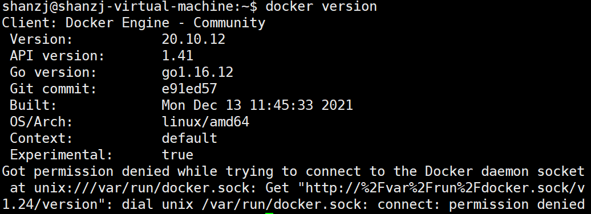

**安装Docker-Compose**

1. 运行以下命令下载 Docker Compose 的当前稳定版本：

   > 要安装不同版本的 Compose，请替换`1.29.2` 为您要使用的 Compose 版本。

   

   ```bash
   国外：sudo curl -L "https://github.com/docker/compose/releases/download/1.29.2/docker-compose-$(uname -s)-$(uname -m)" -o /usr/local/bin/docker-compose
   
   
   国内：sudo curl -L "https://get.daocloud.io/docker/compose/releases/download/1.29.2/docker-compose-$(uname -s)-$(uname -m)" -o /usr/local/bin/docker-compose
   ```

   > 这个国内的别人博客的，很多人都写的这个源，但是我亲测不行！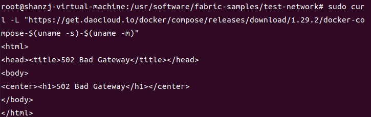
   >
   > 如果你从github上下不下来的话，你就尝试在浏览器上下载，然后通过ftp之类的传到机子上去。
   >
   > 下载地址：https://github.com/docker/compose/releases/download/1.29.2/docker-compose-Linux-x86_64
   >
   > 后面的`$(uname -s)-$(uname -m)`就根据你的机子来改
   >
   > 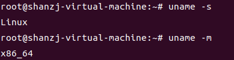
   >
   > 注意存放位置：`/usr/local/bin/`
   >
   > 还有记得改名字：`docker-compose`

   

2. 将可执行权限应用于二进制文件：

   ```bash
   sudo chmod +x /usr/local/bin/docker-compose
   ```

3. 通过运行`hello-world` 映像来验证 Docker 引擎是否已正确安装。

   ```bash
   sudo docker run hello-world
   ```

4. 通过命令验证``docker-compose``是否安装成功

   ```bash
   docker-compose --version
   ```

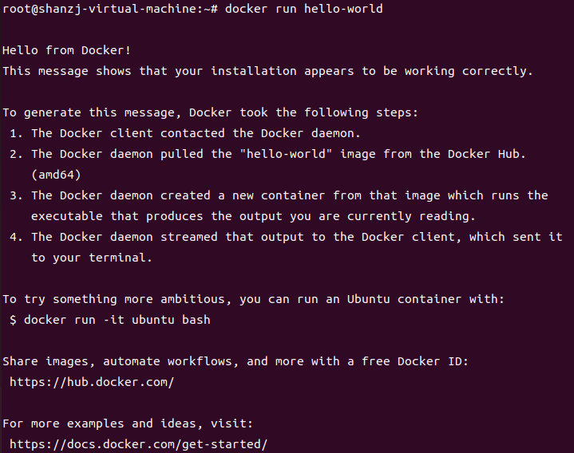

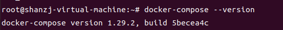

### 1.1.3 安装Go

**下载软件包**

这里使用go1.17 官方推荐1.16.x

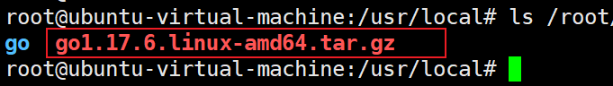

**配置go环境变量**

```bash
vim /etc/profile

# 在最后一行添加
export GO_HOME=/usr/software/go
export PATH=$GO_HOME/bin:$PATH

source /etc/profile

#查看是否成功
go version
```

**设置go代理**

一般执行这个就够了

`export GOPROXY=https://goproxy.io,direct`

执行 `go env`

可以看到

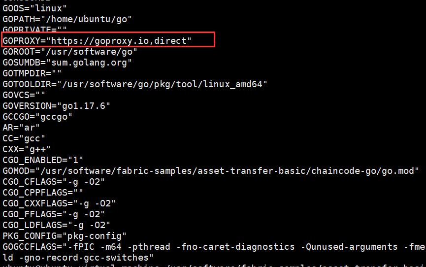

下面是官方文档中的

> 您只需通过简单设置
>
> **Bash (Linux or macOS)**
>
> ```shell
> # 配置 GOPROXY 环境变量
> export GOPROXY=https://goproxy.io,direct
> # 还可以设置不走 proxy 的私有仓库或组，多个用逗号相隔（可选）
> export GOPRIVATE=git.mycompany.com,github.com/my/private
> ```
>
> **PowerShell (Windows)**
>
> ```shell
> # 配置 GOPROXY 环境变量
> $env:GOPROXY = "https://goproxy.io,direct"
> # 还可以设置不走 proxy 的私有仓库或组，多个用逗号相隔（可选）
> $env:GOPRIVATE = "git.mycompany.com,github.com/my/private"
> ```
>
> 设置完上面几个环境变量后，您的 `go` 命令将从公共代理镜像中快速拉取您所需的依赖代码了。或者，还可以根据[文档](https://goproxy.io/zh/docs/getting-started.html)进行设置使其长期生效。如果您使用的是老版本的 Go（< 1.13）, 我们建议您[升级为最新稳定版本](https://gomirrors.org/)。

### 1.1.4 安装JAVA

1. ### 上传 

   jdk-8u241-linux-x64.tar

2. ### 解压

   ```bash
   sudo tar -xzvf /usr/software/jdk-8u241-linux-x64.tar.gz -C /usr/software/
   ```

3. ### 配置环境变量

   ```bash
   sudo vim /etc/profile
   ```

4. ### 在最后一行输入

   ```shell
   export JAVA_HOME=/usr/software/jdk1.8.0_241
   export GO_HOME=/usr/software/go
   export PATH=.:$JAVA_HOME/bin:$GO_HOME/bin:$PATH
   export CLASSPATH=.:$JAVA_HOME/lib/dt.jar:$JAVA_HOME/lib/tools.jar
   ```

5. ### 立即生效环境变量

   ```bash
   source /etc/profile
   ```

6. ### 查看环境是否生效

   ```bash
   java -version
   ```

   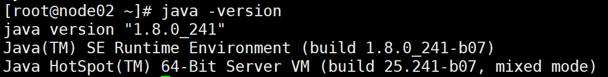
   

## 1.2 安装Fabric和Fabric Samples

### 1.2.1 下载Fabric sample，docker镜像

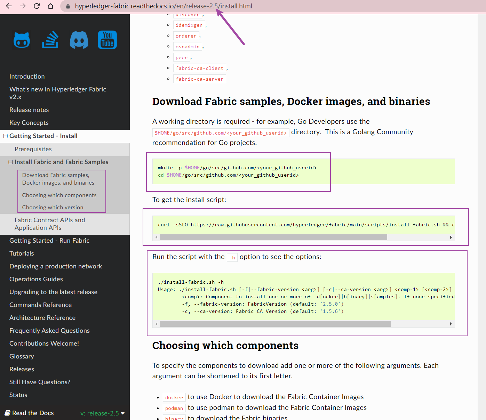

```
这是官方的那行命令:  curl -sSLO https://raw.githubusercontent.com/hyperledger/fabric/main/scripts/install-fabric.sh && chmod +x install-fabric.sh

如果你下载失败了，就在你pc上访问上面的网站，然后编辑好，传进虚拟机也好，服务器也好，然后执行 `chmod +x install-fabric.sh` 就好了
```

```
这是我的： （指定为当前最新的，以防你看到文档时最新版不是2.5.0了）
./install-fabric.sh -f 2.5.0 -c 1.5.6

执行完之后：会帮你下载fabric的docker镜像，以及克隆fabric-samples仓库
```

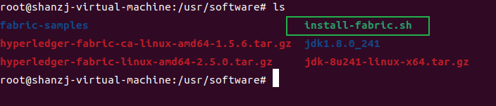

### 1.2.2 下载binaries(二进制文件)

```
https://github.com/hyperledger/fabric/releases/download/v2.5.0/hyperledger-fabric-linux-amd64-2.5.0.tar.gz

https://github.com/hyperledger/fabric-ca/releases/download/v1.5.6/hyperledger-fabric-ca-linux-amd64-1.5.6.tar.gz
```

### 1.2.3 解压并复制binaries

```bash
tar -zxvf hyperledger-fabric-linux-amd64-2.5.0.tar.gz -C ./fabric-samples

tar -zxvf hyperledger-fabric-ca-linux-amd64-1.5.6.tar.gz -C ./fabric-samples
```

### 1.2.4 复制bin文件

将整个bin目录下文件复制到 /usr/bin 下，这是fabric的二进制文件，用来生成证书，生成同道，生成初始块文件等等

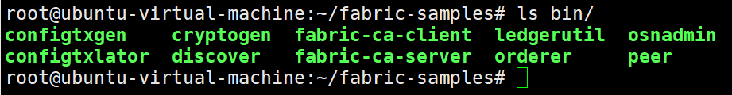

```bash
root@ubuntu-virtual-machine:~/fabric-samples/bin# cp * /usr/local/bin/
```

### 1.2.5 测试Fabric是否安装成功

1. 进入工作目录

	```bash
	cd /usr/software/fabric-samples/test-network
	```
	
2. 启动测试网络

   ```bash
    ./network.sh up
   ```

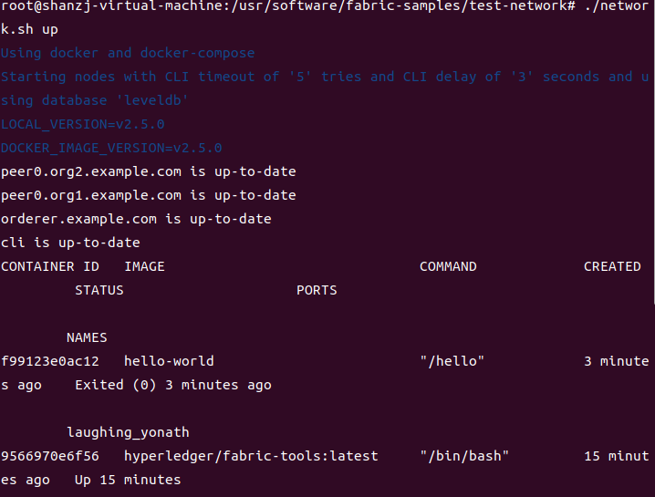

3. 关闭测试网络

   默认会帮你删除所有的容器

   ```bash
   ./network.sh down
   ```

   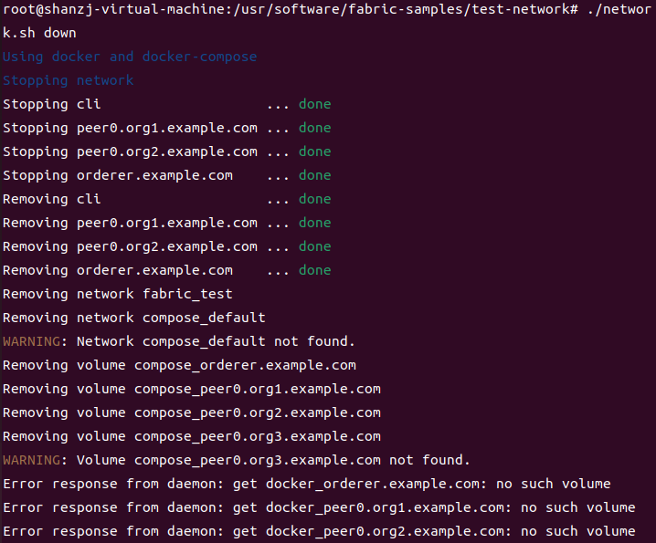