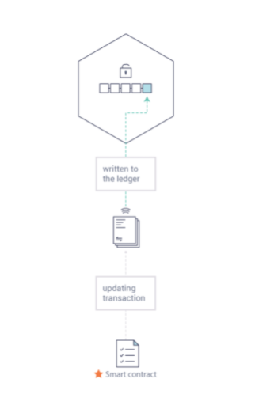
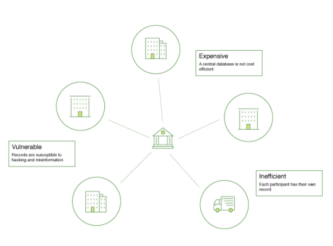
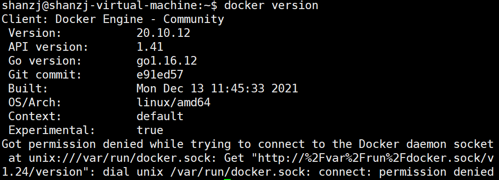
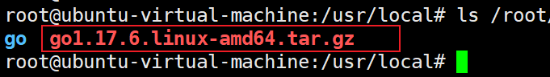
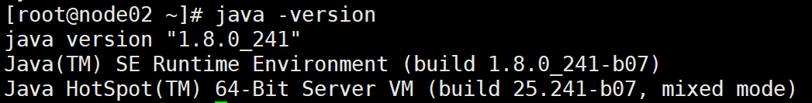

# 1. 概念介绍

## 1.1 区块链是什么？

一般而言，区块链是不可变的交易账本，维护在**对等节点**的分布式网络中。这些节点每个都通过应用已通过**共识协议**验证的交易来维护账本的副本，这些交易被分组为包含将每个块绑定到前一个块的哈希的块。

区块链的第一个也是最广泛认可的应用是**比特币**（加密货币），尽管其他人也纷纷效仿。以太坊是另一种加密货币，采用了不同的方法，集成了许多与比特币相同的特征，但添加了**智能合约**以创建分布式应用程序平台。比特币和以太坊属于一类区块链，我们将其归类为 **公共许可**区块链技术。基本上，这些是公共网络，对任何人开放，参与者匿名互动。

随着比特币、以太坊和其他一些衍生技术的普及，将区块链、分布式账本和分布式应用平台的底层技术应用于更具创新性的**企业用例**的兴趣也在增长。然而，许多企业用例需要未经许可的区块链技术（目前）无法提供的性能特征。此外，在许多用例中，参与者的身份是一项硬性要求，例如在金融交易中，必须遵守了解你的客户 (KYC) 和反洗钱 (AML) 规定。

对于企业使用，我们需要考虑以下需求：

- 参与者必须被识别/可识别
- 网络需要获得**许可**
- 高交易吞吐量性能
- 交易确认延迟低
- 与商业交易有关的交易和数据的隐私和机密性

虽然许多早期的区块链平台目前正在**适应**企业使用，但Hyperledger Fabric从一开始就是为企业使用而**设计**的。以下部分描述了 Hyperledger Fabric (Fabric) 如何与其他区块链平台区分开来，并描述了其架构决策的一些动机。

### 1.1.1 分布式账本（Distributed Ledger）

一个区块链网络的核心是一个分布式账本，在这个账本中记录了网络中发生的所有交易信息。

区块链账本通常被定义为**去中心化**，这是因为在整个网络中，每个参与者都保存着一个区块链账本的副本，所有参与者通过**协作**共同维护着账本。接下来我们会看到，去中心化与协作这两个特点在现实世界的商业货物交易和商务服务中展现出的显著优点。


除了去中心化与协作，区块链的另一个显著特点是信息在只能以“附加”的方式记录在区块链中，**同时使用加密技术保障了交易一旦被添加进账本中，就无法被篡改。**区块链的这种不可篡改性使得信息来源的确认变得异常容易，这是由于参与者可以肯定信息一旦被写入区块链中就几乎不可被篡改。这也是为什么区块链常常也被称为**证明的系统**的原因。

### 1.1.2 智能合约（Smart Contracts）

为了持续的进行信息的更新，以及对账本进行管理（写入交易，进行查询等），区块链网络引入了**智能合约**来实现对账本的访问和控制。



智能合约不仅仅可用于在区块链网络中打包信息，它们也可以被用于自动的执行由参与者定义的特定交易操作。

例如，买卖双方可以定义一个智能合约，以保证当卖方发货的商品运送到达时，买方支付的货款会自动转账给卖方。

### 1.1.3 共识（Consensus）

保持网络中所有账本交易的同步流程，就是**共识**。共识保证了账本只会在交易双方都确认后才进行更新。同时在账本更新时，交易双方能够在账本中的相同位置，更新一个相同的交易信息。


## 1.2 区块链为什么切实可行？

### 1.2.1 当前的记录系统

自从商业数据记录网络系统诞生以来，直到今天的交易网络并没有发生太大的变化。在**商业网络**中的成员进行相互交易时，他们各自维护着自己独立的交易记录。同时，人们交易的物品——无论是16世纪佛兰德的挂毯，还是现代的有价证券——都任然需要在每次卖出交易过程中提供来源信息，以确保卖方拥有所出售商品的所有权。

当前的商业网络就像下图描述的一样：



随着科技的进步，上图中的交易流程不断演化发展，经历了从使用石碑、使用纸质账本、使用硬盘存储器直到使用云计算平台的不同阶段，但流程的底层架构并没有发生任何变化。并不存在一个可以统一管理网络参与者身份的系统，确认商品来源十分费劲，常常会耗费数天的时间明确证券的交易（包含数以万计美元的数量）。人们必须签订合约并手动执行，每一个系统中的数据库都包含着独立的信息并最终代表一个单点的错误。

在今天的信息和过程共享断裂的方法中，建立一个跨越商业网络的记录系统是不可能的，尽管可见性和信任的需求是明确的。

### 1.2.2 区块链的不同点

那我们为什么不用“现代”的交易系统来替代这种效率低下的网络？新的商业网络可以具有标准的方法建立身份信息，执行交易，并且存储数据。为什么不建立一个可信的交易链条记录？通过查询这个链条上的所有交易，来确定交易商品来源，并且这个链条上的信息一旦被写入，就无法被再次篡改。

以上描述的商业网络就如下图所示：


这就是区块链网络。在区块链网络中，每一个参与者都保有一份账本的副本。在区块链网络中，不仅仅是账本信息会被共享，更新账本的流程也是共享的。不同于目前的系统——参与者使用**私有**的程序对**私有**的账本进行更新，而区块链系统使用**共享**的程序对**共享**的账本进行更新。

通过使用共享账本协调整个商业网络，区块链网络能够减少时间、成本以及隐私信息泄露的风险，并且能使流程更加可信和透明。

现在你已经明白了什么是区块链以及它的用途。同时还有许多其他的内容也非常重要，他们是信息与流程共享的基础知识。

## 1.3 Hyperledger Fabric是什么？

### 1.3 1 Hyperledger Fabric

2015年，Linux基金会启动了Hyperledger项目，目标是发展跨行业的区块链技术。Hyperledger项目并不仅仅是定义一个单一的区块链标准，它更鼓励通过开源社区的力量协作开发区块链技术。

Hyperledger Fabric是Hyperledger中的一个区块链项目。与其他区块链技术类似，Hyperledger Fabric包含一个账本，使用智能合约并且是一个通过所有参与者管理交易的系统。

Hyperledger Fabric与其他区块链系统最大的不同体现在**私有**和**许可**。与开放无需许可的网络系统允许未知身份的参与者加入网络不同（需要通过工作量证明协议来保证交易有效并维护网络的安全），Hyperledger Fabric通过**Membership Service Provider(MSP)**来登记所有的成员。

Hyperledger Fabric也提供了多个可拔插选项。账本数据可被存储为多种格式，共识机制可被接入或者断开，同时支持多种不同的MSP。

Hyperledger Fabric提供了建立**channel**的功能，这允许参与者为交易新建一个单独的账本。当网络中的一些参与者是竞争对手时，这个功能变得尤为重要。因为这些参与者并不希望所有的交易信息——比如提供给部分客户的特定价格信息——都对网络中所有参与者公开。只有在同一个channel中的参与者，才会拥有该channel中的账本，而其他不在此channel中的参与者则看不到这个账本。

### 1.3.2 共享账本

Hyperledger Fabric包含一个账本子系统，这个子系统包含两个组件：**世界状态(world state)**和**交易记录**。在Hyperledger Fabric网络中的每一个参与者都拥有一个账本的副本。

世界状态组件描述了账本在特定时间点的状态，它是账本的数据库。交易记录组件记录了产生世界状态当前值的所有交易，它是世界状态的更新历史。那么，账本则是世界状态数据库和交易历史记录的集合。

账本的世界状态存储数据库是可更换的。默认配置下，这是一个key-value存储数据库。交易记录模块不需要被接入。只需要记录在区块链网络中账本数据库被使用时之前和之后的值就可以了。

### 1.3.3 智能合约

Hyperledger Fabric智能合约被称为**chaincode**，当一个区块链外部的一个应用程序需要访问账本时，就会调用chaincode。大多数情况下，chaincode只会访问账本的数据库组件和世界状态(world state)（比如查询），但不会查询交易记录。

chaincode可通过多种不同编程语言实现。目前支持chaincode的语言是Go（包含对java的支持），更多的编程语言会在今后的版本中获得支持。

### 1.3.4 隐私

根据网络的需求，在一个Business-to-Business（B2B）网络中的参与者会对信息共享的程度极为敏感。然而，对于其他的网络，隐私并不是首要考虑的因素。

Hyperledger Fabric支持构建隐私保护严格的网络，也支持构建相对开放的网络。

### 1.3.5 共识

在网络中，不同的参与者写入的交易必须按照产生顺序依次被写入账本中。要实现这一目标，交易顺序必须被正确的建立并且必须包含拒绝错误（或者恶意）插入账本中的无效交易的方法。

这完全是计算机科学的研究领域，可以有多种方法实现上面提到的目标，这些方法各有优缺点。例如，PBFT (Practical Byzantine Fault Tolerance)可以为文件副本提供一种机制来相互通信，即使是在发生腐败的情况下，也可以保证每个副本保持一致。另外，在比特币中，通过一种称为挖矿的行为进行排序。在挖矿过程中，竞争的计算机竞相解决一个密码难题，这个谜题定义了所有后续的构建顺序。

Hyperledger Fabric被设计为允许网络构建者依据业务需求来选择采用的共识机制。好比考虑隐私性，就会有一连串的需求，从高度结构化的网络或是更加点对点的网络。

更多的Hyperledger Fabric共识机制会在另一份文档中详细描述，这些共识机制目前包含SOLO，Kafka以及后续会添加的SBFT (Simplified Byzantine Fault Tolerance)。


### 1.3.6 生命周期

回顾下fabric的启动过程：创建证书，生成创世区块，通道配置交易块，创建通道，节点加入通道，安装链码，实例化链码，链码的调用。这个是完整的生命周期

# 2. 官方脚本安装

初次使用ubuntu搭建fabric测试网络，必须环境

## 2.1 前提准备

系统：Ubuntu20.04LTS（运行在VMware上）

Ubuntu开启root远程登录

- Git client
- Go version 1.16.x (recommended Go version can be found in project Makefile)
- Docker version 18.03 or later

### 2.1.1 GIT安装

```bash
apt-get install git
```

**Git配置**

**首先要配置的名字和Email地址**，以后每次进行git操作时才能有据可查。打开Git Bash，输入：

```bash
$ git config --global user.name 'your_name'
$ git config --global user.email 'your_email'
```

**创建SSH Key**

> SSH Key必须配置到你的github账户里去

```bash
$ ssh-keygen -t rsa -C 'your_email'
然后一直回车

root@shanzj-virtual-machine:/usr/software# cd ~
root@shanzj-virtual-machine:~# ll
总用量 40
drwx------  4 root root 4096 1月  12 15:47 ./
drwxr-xr-x 20 root root 4096 1月  12 15:08 ../
-rw-------  1 root root   87 1月  12 15:36 .bash_history
-rw-r--r--  1 root root 3106 12月  5  2019 .bashrc
drwx------  2 root root 4096 1月  12 15:37 .cache/
-rw-r--r--  1 root root   28 1月  12 15:47 .gitconfig
-rw-r--r--  1 root root  161 12月  5  2019 .profile
drwx------  2 root root 4096 1月  12 15:49 .ssh/
-rw-------  1 root root 1352 1月  12 15:43 .viminfo
-rw-------  1 root root  136 1月  12 15:42 .Xauthority
root@shanzj-virtual-machine:~# cd .ssh/
root@shanzj-virtual-machine:~/.ssh# ls
id_rsa  id_rsa.pub  known_hosts
root@shanzj-virtual-machine:~/.ssh# cat id_rsa.pub 
ssh-rsa AAAAB3Nz.............
```


### 2.1.2 Docker安装

卸载旧版本

```bash
 sudo apt-get remove docker docker-engine docker.io containerd runc
```

如果`apt-get`报告没有安装这些软件包，那也没关系。

**使用存储库安装**

在新主机上首次安装 Docker Engine 之前，您需要设置 Docker 存储库。之后，您可以从存储库安装和更新 Docker。

**设置存储库**

1. 更新`apt`包索引并安装包以允许`apt`通过 HTTPS 使用存储库

   ```bash
   sudo apt-get update
   
   sudo apt-get install \
       ca-certificates \
       curl \
       gnupg \
       lsb-release
   ```

2. 添加 Docker 的官方 GPG 密钥：添加 Docker 的官方 GPG 密钥

   ```bash
   curl -fsSL https://download.docker.com/linux/ubuntu/gpg | sudo gpg --dearmor -o /usr/share/keyrings/docker-archive-keyring.gpg
   ```

3. 使用以下命令设置**稳定**存储库

   ```bash
   echo \
     "deb [arch=$(dpkg --print-architecture) signed-by=/usr/share/keyrings/docker-archive-keyring.gpg] https://download.docker.com/linux/ubuntu \
     $(lsb_release -cs) stable" | sudo tee /etc/apt/sources.list.d/docker.list > /dev/null
   ```

**安装 Docker 引擎**

```bash
sudo apt-get update

sudo apt-get install docker-ce docker-ce-cli containerd.io
```

如果要安装*特定版本*的 Docker Engine，请在 repo 中列出可用版本，然后选择并安装

```bash
apt-cache madison docker-ce

docker-ce | 5:20.10.12~3-0~ubuntu-focal | https://download.docker.com/linux/ubuntu focal/stable amd64 Packages
 docker-ce | 5:20.10.11~3-0~ubuntu-focal | https://download.docker.com/linux/ubuntu focal/stable amd64 Packages
 docker-ce | 5:20.10.10~3-0~ubuntu-focal | https://download.docker.com/linux/ubuntu focal/stable amd64 Packages
 docker-ce | 5:20.10.9~3-0~ubuntu-focal | https://download.docker.com/linux/ubuntu focal/stable amd64 Packages
 docker-ce | 5:20.10.8~3-0~ubuntu-focal | https://download.docker.com/linux/ubuntu focal/stable amd64 Packages
 
sudo apt-get install docker-ce=<VERSION_STRING> docker-ce-cli=<VERSION_STRING> containerd.io
```

通过运行`hello-world` 映像来验证 Docker 引擎是否已正确安装。



**安装Docker-Compose**

1. 运行以下命令下载 Docker Compose 的当前稳定版本：

   ```bash
   sudo curl -L "https://github.com/docker/compose/releases/download/1.29.2/docker-	compose-$(uname -s)-$(uname -m)" -o /usr/local/bin/docker-compose
   ```

   > 要安装不同版本的 Compose，请替换`1.29.2` 为您要使用的 Compose 版本。

2. 将可执行权限应用于二进制文件：

   ```bash
   sudo chmod +x /usr/local/bin/docker-compose
   ```

3. 通过运行`hello-world` 映像来验证 Docker 引擎是否已正确安装。

   ```bash
   sudo docker run hello-world
   ```


### 2.1.3 安装Go

**下载软件包**

这里使用go1.17 官方推荐1.16.x



**配置go环境变量**

```bash
vim /etc/profile

# 在最后一行添加
export GO_HOME=/usr/software/go
export PATH=$GO_HOME/bin:$PATH

source /etc/profile

#查看是否成功
go version
```

**设置go代理**

一般执行这个就够了

`export GOPROXY=https://goproxy.io,direct`

执行 `go env`

可以看到


下面是官方文档中的

> 您只需通过简单设置
>
> **Bash (Linux or macOS)**
>
> ```shell
> # 配置 GOPROXY 环境变量
> export GOPROXY=https://goproxy.io,direct
> # 还可以设置不走 proxy 的私有仓库或组，多个用逗号相隔（可选）
> export GOPRIVATE=git.mycompany.com,github.com/my/private
> ```
>
> **PowerShell (Windows)**
>
> ```shell
> # 配置 GOPROXY 环境变量
> $env:GOPROXY = "https://goproxy.io,direct"
> # 还可以设置不走 proxy 的私有仓库或组，多个用逗号相隔（可选）
> $env:GOPRIVATE = "git.mycompany.com,github.com/my/private"
> ```
>
> 设置完上面几个环境变量后，您的 `go` 命令将从公共代理镜像中快速拉取您所需的依赖代码了。或者，还可以根据[文档](https://goproxy.io/zh/docs/getting-started.html)进行设置使其长期生效。如果您使用的是老版本的 Go（< 1.13）, 我们建议您[升级为最新稳定版本](https://gomirrors.org/)。


### 2.1.4 安装JAVA

1. ### 上传 

   jdk-8u241-linux-x64.tar

2. ### 解压

   ```bash
   sudo tar -xzvf /usr/software/jdk-8u241-linux-x64.tar.gz -C /usr/software/
   ```

3. ### 配置环境变量

   ```bash
   sudo vim /etc/profile
   ```

4. ### 在最后一行输入

   ```shell
   export JAVA_HOME=/usr/software/jdk1.8.0_251
   export GO_HOME=/usr/software/go
   export PATH=.:$JAVA_HOME/bin:$GO_HOME/bin:$PATH
   export CLASSPATH=.:$JAVA_HOME/lib/dt.jar:$JAVA_HOME/lib/tools.jar
   ```

5. ### 立即生效环境变量

   ```bash
   sudo source /etc/profile
   ```

   

6. ### 查看环境是否生效

   ```bash
   java -version
   ```

   


## 2.2 安装Fabric和Fabric Samples

### 2.2.1 下载Fabric sample，docker镜像，和binaries(二进制文件)

```bash
$ curl -sSL https://bit.ly/2ysbOFE | bash -s
```

> 一般情况下会443拒绝连接

本机打开网址，将内容复制下来，编写为bootstrap.sh，自行运行

```bash
root@shanzj-virtual-machine:~# chmod +x ./bootstrap.sh  #给脚本添加执行权限
root@shanzj-virtual-machine:~# ./test.sh           #执行脚本文件
# 执行过程可能会比较慢
# 也有可能不行....看运气。实在不行，就只能配置软路由，在软路由中配置科学上网插件了...
# 单纯的VPN或者socke5代理都是不行的！！
```

> 这里卡了我三四天....终于用树莓派做二级路由器，配科学上网插件实现了下载....正常情况下，`curl -sSL https://bit.ly/2ysbOFE | bash -s` 会直接报443拒绝
---
关于fabric的下载，可以cv`https://bit.ly/2ysbOFE`的脚本在linux下运行：

1. 用浏览器访问网址：https://bit.ly/2ysbOFE
2. 将脚本复制粘贴到虚拟机或是服务器上，比如起名叫`temp.sh`
3. 将脚本其中的一些内容修改，找到以下位置，修改BINARIES为false，卡的原因就是因为这里去下载了两个文件，十分麻烦，我们自己去下载这两个文件，然后用ftp工具传输到虚拟机或服务器即可

```sh
DOCKER=true
SAMPLES=true
BINARIES=false # 改了这里
```

4. 修改完成后运行脚本

```sh
sudo chmod +x temp.sh
./temp.sh
```

4. **注意这里的版本，要和你的脚本文件中的版本对应**，我使用的是2.4.1和1.5.2
   - 用浏览器访问下载1：https://github.com/hyperledger/fabric/releases/download/v2.4.1/hyperledger-fabric-linux-amd64-2.4.1.tar.gz
   - 用浏览器访问下载2：https://github.com/hyperledger/fabric-ca/releases/download/v1.5.2/hyperledger-fabric-ca-linux-amd64-1.5.2.tar.gz
5. 将下载完的软件传输到虚拟机或是服务器上，可以借助xshell等工具
6. 将两个包解压到`fabric-samples`文件夹下，比如

```sh
tar -zxvf hyperledger-fabric-linux-amd64-2.4.1.tar.gz -C ./fabric-samples
tar -zxvf hyperledger-fabric-ca-linux-amd64-1.5.2.tar.gz -C ./fabric-samples
```
这样就可以了

----

### 2.2.2 复制bin文件

将整个bin目录下文件复制到 /usr/bin 下，这是fabric的二进制文件，用来生成证书，生成同道，生成初始块文件等等


```bash
root@ubuntu-virtual-machine:~/fabric-samples/bin# cp * /usr/local/bin/
```


### 2.2.3 补充

这是我在执行脚本的过程中的一些信息，可以参考下具体拉取了哪些东西


```bash
root@ubuntu-virtual-machine:~# curl -sSL https://bit.ly/2ysbOFE | bash -s

Clone hyperledger/fabric-samples repo

===> Changing directory to fabric-samples
fabric-samples v2.4.1 does not exist, defaulting to main. fabric-samples main branch is intended to work with recent versions of fabric.

Pull Hyperledger Fabric binaries

===> Downloading version 2.4.1 platform specific fabric binaries
===> Downloading:  https://github.com/hyperledger/fabric/releases/download/v2.4.1/hyperledger-fabric-linux-amd64-2.4.1.tar.gz
  % Total    % Received % Xferd  Average Speed   Time    Time     Time  Current
                                 Dload  Upload   Total   Spent    Left  Speed
100   680  100   680    0     0    622      0  0:00:01  0:00:01 --:--:--   622
100 75.4M  100 75.4M    0     0  5274k      0  0:00:14  0:00:14 --:--:-- 6531k
==> Done.
===> Downloading version 1.5.2 platform specific fabric-ca-client binary
===> Downloading:  https://github.com/hyperledger/fabric-ca/releases/download/v1.5.2/hyperledger-fabric-ca-linux-amd64-1.5.2.tar.gz
  % Total    % Received % Xferd  Average Speed   Time    Time     Time  Current
                                 Dload  Upload   Total   Spent    Left  Speed
100   683  100   683    0     0    744      0 --:--:-- --:--:-- --:--:--   744
100 25.4M  100 25.4M    0     0  3723k      0  0:00:07  0:00:07 --:--:-- 5282k
==> Done.

Pull Hyperledger Fabric docker images

FABRIC_IMAGES: peer orderer ccenv tools baseos
===> Pulling fabric Images
====> hyperledger/fabric-peer:2.4.1
2.4.1: Pulling from hyperledger/fabric-peer
Digest: sha256:fa7bc1485e94253bbc24d1a970d993452ad1693b27c549d33e7e3434e809776d
Status: Image is up to date for hyperledger/fabric-peer:2.4.1
docker.io/hyperledger/fabric-peer:2.4.1
====> hyperledger/fabric-orderer:2.4.1
2.4.1: Pulling from hyperledger/fabric-orderer
Digest: sha256:f6753c1a079acc1403401c54939efe284efe4b1f8f873e5f5bfb3de09fca6124
Status: Image is up to date for hyperledger/fabric-orderer:2.4.1
docker.io/hyperledger/fabric-orderer:2.4.1
====> hyperledger/fabric-ccenv:2.4.1
2.4.1: Pulling from hyperledger/fabric-ccenv
a0d0a0d46f8b: Pull complete 
31adcdaf11c8: Pull complete 
b8b176561691: Pull complete 
ffa5077b735b: Waiting 
2e51fde7a4ad: Download complete 
412d0ce856c1: Download complete 
572b26125af9: Download complete 
098ec7aac67c: Download complete 
4fa2da36fe14: Download complete 
^C
root@ubuntu-virtual-machine:~# curl -sSL https://bit.ly/2ysbOFE | bash -s

Clone hyperledger/fabric-samples repo

===> Changing directory to fabric-samples
fabric-samples v2.4.1 does not exist, defaulting to main. fabric-samples main branch is intended to work with recent versions of fabric.

Pull Hyperledger Fabric binaries

===> Downloading version 2.4.1 platform specific fabric binaries
===> Downloading:  https://github.com/hyperledger/fabric/releases/download/v2.4.1/hyperledger-fabric-linux-amd64-2.4.1.tar.gz
  % Total    % Received % Xferd  Average Speed   Time    Time     Time  Current
                                 Dload  Upload   Total   Spent    Left  Speed
100   680  100   680    0     0    396      0  0:00:01  0:00:01 --:--:--   397
100 75.4M  100 75.4M    0     0  4920k      0  0:00:15  0:00:15 --:--:-- 6086k
==> Done.
===> Downloading version 1.5.2 platform specific fabric-ca-client binary
===> Downloading:  https://github.com/hyperledger/fabric-ca/releases/download/v1.5.2/hyperledger-fabric-ca-linux-amd64-1.5.2.tar.gz
  % Total    % Received % Xferd  Average Speed   Time    Time     Time  Current
                                 Dload  Upload   Total   Spent    Left  Speed
100   683  100   683    0     0    643      0  0:00:01  0:00:01 --:--:--   643
  0 25.4M    0 35206    0     0   2735      0  2:42:50  0:00:12  2:42:38     0
curl: (18) transfer closed with 26688075 bytes remaining to read

gzip: stdin: unexpected end of file
tar: 归档文件中异常的 EOF
tar: 归档文件中异常的 EOF
tar: Error is not recoverable: exiting now
==> There was an error downloading the binary file.

------> 1.5.2 fabric-ca-client binary is not available to download  (Available from 1.1.0-rc1) <----

root@ubuntu-virtual-machine:~# curl -sSL https://bit.ly/2ysbOFE | bash -s

Clone hyperledger/fabric-samples repo

===> Changing directory to fabric-samples
fabric-samples v2.4.1 does not exist, defaulting to main. fabric-samples main branch is intended to work with recent versions of fabric.

Pull Hyperledger Fabric binaries

===> Downloading version 2.4.1 platform specific fabric binaries
===> Downloading:  https://github.com/hyperledger/fabric/releases/download/v2.4.1/hyperledger-fabric-linux-amd64-2.4.1.tar.gz
  % Total    % Received % Xferd  Average Speed   Time    Time     Time  Current
                                 Dload  Upload   Total   Spent    Left  Speed
100   680  100   680    0     0   1402      0 --:--:-- --:--:-- --:--:--  1402
100 75.4M  100 75.4M    0     0  2142k      0  0:00:36  0:00:36 --:--:-- 6255k
==> Done.
===> Downloading version 1.5.2 platform specific fabric-ca-client binary
===> Downloading:  https://github.com/hyperledger/fabric-ca/releases/download/v1.5.2/hyperledger-fabric-ca-linux-amd64-1.5.2.tar.gz
  % Total    % Received % Xferd  Average Speed   Time    Time     Time  Current
                                 Dload  Upload   Total   Spent    Left  Speed
100   683  100   683    0     0    132      0  0:00:05  0:00:05 --:--:--   173
  0     0    0     0    0     0      0      0 --:--:--  0:00:10 --:--:--     0
curl: (35) OpenSSL SSL_connect: SSL_ERROR_SYSCALL in connection to objects.githubusercontent.com:443 

gzip: stdin: unexpected end of file
tar: Child returned status 1
tar: Error is not recoverable: exiting now
==> There was an error downloading the binary file.

------> 1.5.2 fabric-ca-client binary is not available to download  (Available from 1.1.0-rc1) <----

root@ubuntu-virtual-machine:~# curl -sSL https://bit.ly/2ysbOFE | bash -s

Clone hyperledger/fabric-samples repo

===> Changing directory to fabric-samples
fabric-samples v2.4.1 does not exist, defaulting to main. fabric-samples main branch is intended to work with recent versions of fabric.

Pull Hyperledger Fabric binaries

===> Downloading version 2.4.1 platform specific fabric binaries
===> Downloading:  https://github.com/hyperledger/fabric/releases/download/v2.4.1/hyperledger-fabric-linux-amd64-2.4.1.tar.gz
  % Total    % Received % Xferd  Average Speed   Time    Time     Time  Current
                                 Dload  Upload   Total   Spent    Left  Speed
100   680  100   680    0     0    944      0 --:--:-- --:--:-- --:--:--   943
100 75.4M  100 75.4M    0     0  5582k      0  0:00:13  0:00:13 --:--:-- 6283k
==> Done.
===> Downloading version 1.5.2 platform specific fabric-ca-client binary
===> Downloading:  https://github.com/hyperledger/fabric-ca/releases/download/v1.5.2/hyperledger-fabric-ca-linux-amd64-1.5.2.tar.gz
  % Total    % Received % Xferd  Average Speed   Time    Time     Time  Current
                                 Dload  Upload   Total   Spent    Left  Speed
100   683  100   683    0     0    945      0 --:--:-- --:--:-- --:--:--   944
100 25.4M  100 25.4M    0     0  1181k      0  0:00:22  0:00:22 --:--:-- 2383k
==> Done.

Pull Hyperledger Fabric docker images

FABRIC_IMAGES: peer orderer ccenv tools baseos
===> Pulling fabric Images
====> hyperledger/fabric-peer:2.4.1
2.4.1: Pulling from hyperledger/fabric-peer
Digest: sha256:fa7bc1485e94253bbc24d1a970d993452ad1693b27c549d33e7e3434e809776d
Status: Image is up to date for hyperledger/fabric-peer:2.4.1
docker.io/hyperledger/fabric-peer:2.4.1
====> hyperledger/fabric-orderer:2.4.1
2.4.1: Pulling from hyperledger/fabric-orderer
Digest: sha256:f6753c1a079acc1403401c54939efe284efe4b1f8f873e5f5bfb3de09fca6124
Status: Image is up to date for hyperledger/fabric-orderer:2.4.1
docker.io/hyperledger/fabric-orderer:2.4.1
====> hyperledger/fabric-ccenv:2.4.1
2.4.1: Pulling from hyperledger/fabric-ccenv
a0d0a0d46f8b: Pull complete 
31adcdaf11c8: Pull complete 
b8b176561691: Pull complete 
ffa5077b735b: Pull complete 
2e51fde7a4ad: Pull complete 
412d0ce856c1: Pull complete 
572b26125af9: Pull complete 
098ec7aac67c: Pull complete 
4fa2da36fe14: Pull complete 
Digest: sha256:312ac73380cd4e67daca6873a7ced7f2dc8a9cbd58373a958ed47de439789770
Status: Downloaded newer image for hyperledger/fabric-ccenv:2.4.1
docker.io/hyperledger/fabric-ccenv:2.4.1
====> hyperledger/fabric-tools:2.4.1
2.4.1: Pulling from hyperledger/fabric-tools
a0d0a0d46f8b: Already exists 
31adcdaf11c8: Already exists 
b8b176561691: Already exists 
ffa5077b735b: Already exists 
2e51fde7a4ad: Already exists 
2807d11847a5: Pull complete 
2fbe4ceef6b2: Pull complete 
c799134d0e25: Pull complete 
Digest: sha256:8ade1c0dc6ff981ffd1b08cf8d2be3923475ddc2982fa60af736ba8e75d9cae4
Status: Downloaded newer image for hyperledger/fabric-tools:2.4.1
docker.io/hyperledger/fabric-tools:2.4.1
====> hyperledger/fabric-baseos:2.4.1
2.4.1: Pulling from hyperledger/fabric-baseos
97518928ae5f: Already exists 
a4e330cdd5f6: Already exists 
b1c68c7f61cd: Pull complete 
Digest: sha256:06387f32c665e71e271bf64a054ccaea79ab9b38ab07f93d35930a3b5780b10c
Status: Downloaded newer image for hyperledger/fabric-baseos:2.4.1
docker.io/hyperledger/fabric-baseos:2.4.1
===> Pulling fabric ca Image
====> hyperledger/fabric-ca:1.5.2
1.5.2: Pulling from hyperledger/fabric-ca
a0d0a0d46f8b: Already exists 
ac8258c0aeb1: Pull complete 
6c802cf1fa97: Pull complete 
Digest: sha256:faa3b743d9ed391c30f518a7cc1168160bf335f3bf60ba6aaaf1aa49c1ed023e
Status: Downloaded newer image for hyperledger/fabric-ca:1.5.2
docker.io/hyperledger/fabric-ca:1.5.2
===> List out hyperledger docker images
hyperledger/fabric-tools     2.4       286b1b8f098f   3 weeks ago     458MB
hyperledger/fabric-tools     2.4.1     286b1b8f098f   3 weeks ago     458MB
hyperledger/fabric-tools     latest    286b1b8f098f   3 weeks ago     458MB
hyperledger/fabric-peer      2.4       b3e5bf2a6224   3 weeks ago     63.3MB
hyperledger/fabric-peer      2.4.1     b3e5bf2a6224   3 weeks ago     63.3MB
hyperledger/fabric-peer      latest    b3e5bf2a6224   3 weeks ago     63.3MB
hyperledger/fabric-orderer   2.4       37df790c7d16   3 weeks ago     37.2MB
hyperledger/fabric-orderer   2.4.1     37df790c7d16   3 weeks ago     37.2MB
hyperledger/fabric-orderer   latest    37df790c7d16   3 weeks ago     37.2MB
hyperledger/fabric-ccenv     2.4       d873cda39577   3 weeks ago     504MB
hyperledger/fabric-ccenv     2.4.1     d873cda39577   3 weeks ago     504MB
hyperledger/fabric-ccenv     latest    d873cda39577   3 weeks ago     504MB
hyperledger/fabric-baseos    2.4       8353db1a5b3d   3 weeks ago     6.94MB
hyperledger/fabric-baseos    2.4.1     8353db1a5b3d   3 weeks ago     6.94MB
hyperledger/fabric-baseos    latest    8353db1a5b3d   3 weeks ago     6.94MB
hyperledger/fabric-ca        1.5       4ea287b75c63   4 months ago    69.8MB
hyperledger/fabric-ca        1.5.2     4ea287b75c63   4 months ago    69.8MB
hyperledger/fabric-ca        latest    4ea287b75c63   4 months ago    69.8MB

```

这是我在执行脚本的过程中的一些信息，可以参考下具体拉取了哪些东西


