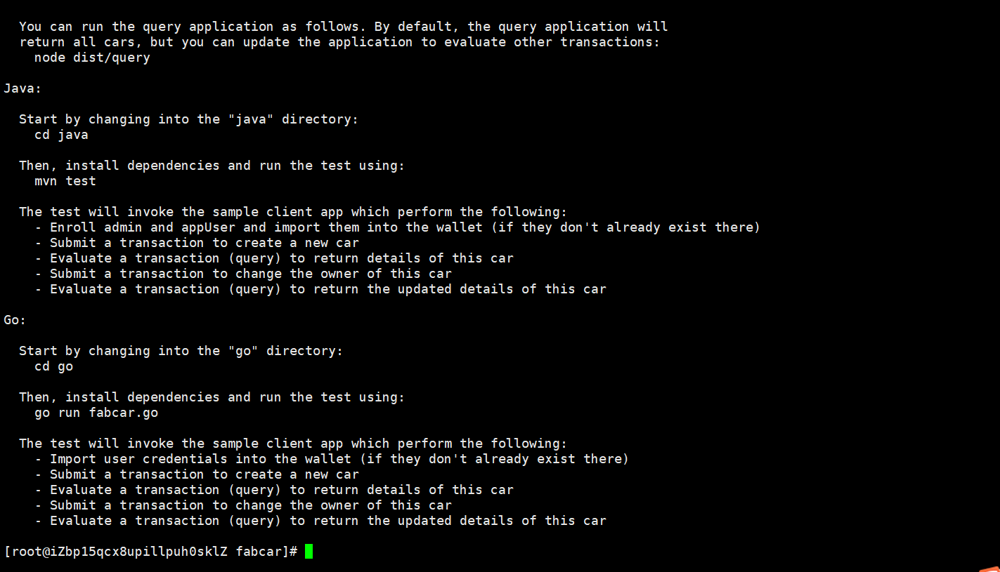

# 1. 脚本部署fabcar(用来测试系统环境的)


## 1.1 进入工作目录

```bash
cd /usr/software/fabric-samples/fabcar/
```


## 1.2 查看工作目录

```bash
[root@iZbp15qcx8upillpuh0sklZ fabcar]# ll
total 28
drwxr-xr-x 2 root root 4096 Feb 27 00:35 go
drwxr-xr-x 4 root root 4096 Feb 27 00:35 java
drwxr-xr-x 3 root root 4096 Feb 27 00:35 javascript
-rwxr-xr-x 1 root root  324 Feb 27 00:35 networkDown.sh
-rwxr-xr-x 1 root root 4303 Feb 27 00:35 startFabric.sh
drwxr-xr-x 4 root root 4096 Feb 27 00:35 typescript
```


## 1.3 执行脚本

启动网络

```bash
./startFabric.sh java
```

关闭网络

```bash
./networkDown.sh
```

> 这个脚本会帮你启动`test-network`中的测试网络，并且帮你创建通道，批准通道，并且安装链码
>
> 可以用官方测试用例中的  `fabric-samples/fabcar/java`来调用链码

**见此图：说明执行成功**




## 1.4 设置FABRIC_CFG_PATH为指向fabric-samples中的core.yaml文件

将 FABRIC_CFG_PATH 设置为指向 fabric-samples 存储库中的 core.yaml 文件：

```bash
export PATH=/usr/software/fabric-samples/bin:$PATH
export FABRIC_CFG_PATH=/usr/software/fabric-samples/config/
```

需要能够使用对等 CLI，请检查二进制文件的版本。二进制文件需要是 2.0.0 或更高版本才能运行本教程。

```bash
peer version
```


## 1.5 在org1 peer上操作

```bash
cd /usr/software/fabric-samples/test-network
```

```bash
export CORE_PEER_TLS_ENABLED=true
export CORE_PEER_LOCALMSPID="Org1MSP"
export CORE_PEER_TLS_ROOTCERT_FILE=${PWD}/organizations/peerOrganizations/org1.example.com/peers/peer0.org1.example.com/tls/ca.crt
export CORE_PEER_MSPCONFIGPATH=${PWD}/organizations/peerOrganizations/org1.example.com/users/Admin@org1.example.com/msp
export CORE_PEER_ADDRESS=localhost:7051
```

## 1.6 调用链码

```bash
peer chaincode query -C mychannel -n fabcar -c '{"Args":["queryAllCars"]}'
```

```bash
peer chaincode query -C mychannel -n fabcar -c '{"Args":["queryCar","CAR1"]}'
```


