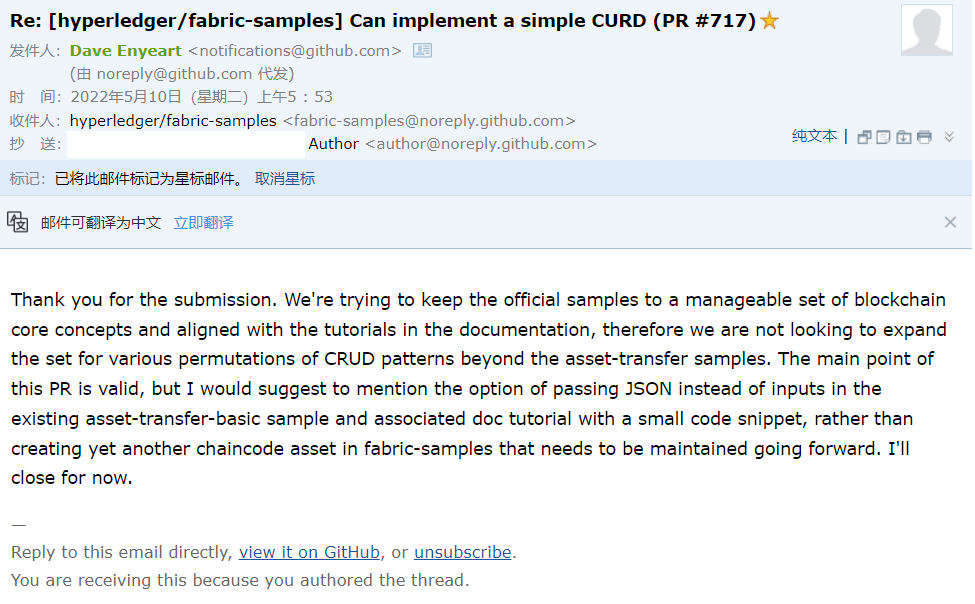
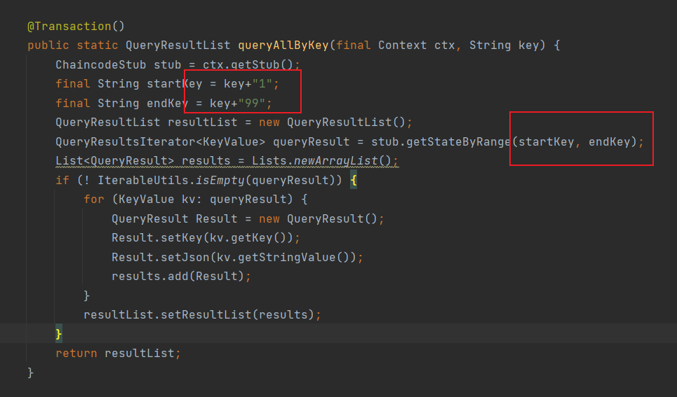
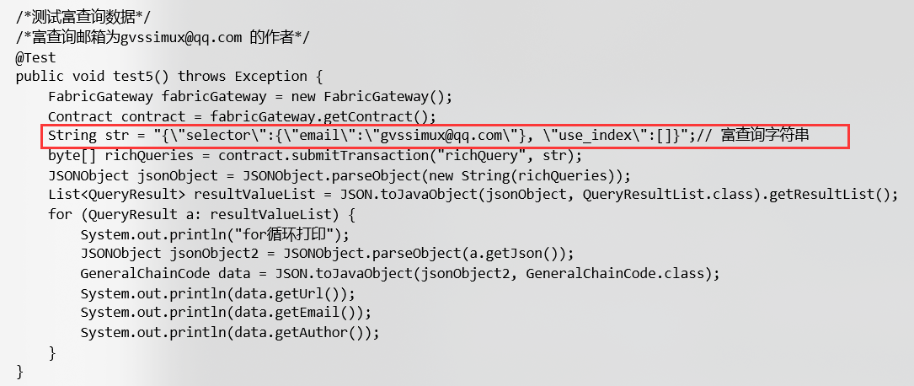

# 项目介绍

通用链码，可以用于快速的增删改查的开发

这个项目是我在做毕设的时候，从毕设中提取出来的。刚开始做毕设时，我真是一头雾水，环境就搭建了快一月，然后又到了写代码的时候，刚开始写链码是按照官方的测试用例来编写的，官方的测试用例中，我参考的是FabCar。由于我的毕设是溯源系统，要记录很多数据，我发现，每个实体都要写链码，而且还要传入很多很多参数用于记录数据。经过我的不断试错，我发现了一个关键点`carState = genson.serialize(car); stub.putStringState(key, carState);` 官方的测试用例是把传进来的参数，附加给了对象，然后把对象序列化后，提交到区块链网络中，这是关键一点！截止我第一次上传这个项目，我在之前的学习中，无论是书籍，还是博主都没有注意到这点，因此我将项目简化并附上测试教程，以供正在被毕设折磨的各位同学们参考。

由于本人经验上浅，技术远不及各位大佬，望能与君共同进步！ps：如果这个项目帮到了你，望可以给我点个星，各位的支持是我不断进步的动力

在此感谢：b站up**老哥没有饿意**，他的视频对我帮助很大

# 如何使用

请看`安装链码的相关操作.md`

或b站视频 [超级账本Fabric通用链码，可以用于快速的增删改查的开发_哔哩哔哩_bilibili](https://www.bilibili.com/video/BV1QS4y117dT/)

注意：此项目不适合刚接触区块链的同学，适合对Fabric有了一定了解，准备开发项目的同学。这套链码应该可以帮助你进行快速的增删改查的开发

# Q&A

1、你这样写和用mysql之类的关系型数据库有什么区别呢？

答：首先我只是个本科生，做的也是本科毕设，我的题目就是要用区块链去管理数据。这套链码能够让你快速进行业务开发，你可以使用这个方法先进行开发，然后等一切就绪的时候，再把**数据的序列化**拿到链码层面去。

我当时也怀疑过这样做有什么缺陷什么的，后来我把这个提交给了`hyperledger/fabric-samples`这个项目，也收到了项目回信，可以参考官方回信酌情使用。

2、有操作文档吗？

答：操作文档在`GeneralChainCode\Doc`下面，但我写的肯定不会和官方文档那么详细，具体还要根据实际结合。

3、`chaincode.jar`是什么？

答：是已经打包好的“通用链码”，对应视频中在idea用maven去打包，最后用到的就是这个文件。

4、链码中的`richQuery()`  `queryAllByKey()`好像使用有些问题

答：先说`queryAllByKey()`，这个方法是根据传入的key进行全部查询的，只可以查询1~99，什么意思呢？举个例子插入数据时的key必须为`email1`、`email2`、`email3`等，后台会根据你传入的`email`这个关键字进行拼接123.....；~~`richQuery()`底层用的是coudb的富查询，由于我对coudb一点都不了解，所以现在还不完善~~目前在毕设中，使用`richQuery()` 没有出现什么问题。

5、`richQuery()`  怎么用？

答：`GeneralChainCode-App\src\test\javaTest02.java`中有使用的demo

> 富查询的数据，必须是JSON格式的！

6、必须启动FabCar这个项目吗，我看其他博主都是用的`test-network`这个项目

答：不一定，因为我要用到Coudb的富查询，而FabCar这个项目正好也是会启用Coudb的，所以每次我写代码进行测试，都是直接启动这个的

7、为什么我在本地用idea跑测试都是可以的，但是放到服务器上不行？

答：可能是身份文件的权限问题。比如说我用的是tomcat，我本机跑测试时，身份文件是以绝对路径指定的，上传到服务器上，开始指定的是fabric-sample文件下的那三个文件，但发现不行。然后我将那三个身份文件放到了tomcat的webapp目录下，项目便可以了。

